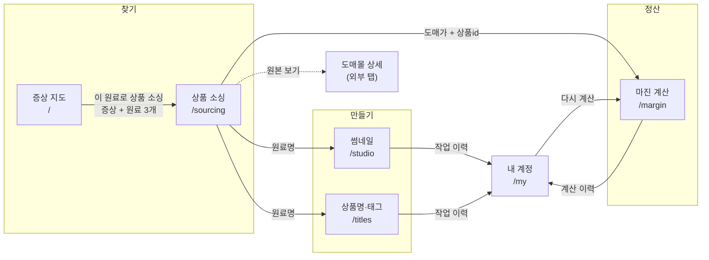

# 사용자 경험 지도

> 이 문서는 **구현된 코드 기준**입니다(2026-07-25). 기획 의도는 [UI-PLAN.md](./UI-PLAN.md),
> 화면 명세는 [SPEC.md](./SPEC.md)를 보세요. 여기는 "셀러가 실제로 어디를 어떻게 지나가는가"만 다룹니다.
> 링크·쿼리 파라미터는 전부 실제 소스에서 확인한 값입니다.

## 1. 이 서비스가 대신해 주는 일

건강기능식품 셀러가 상품 하나를 올리려면 **증상 조사 → 원료 선정 → 도매처 찾기 → 상품명 짓기 →
썸네일 만들기 → 마진 계산**을 각각 다른 도구로 합니다. 이 대시보드는 그걸 한 줄로 잇습니다.

핵심 설계 결정 하나: **모든 외부 데이터는 월 1회 배치 캐시**입니다. 화면에서 도매몰이나
네이버를 실시간으로 부르지 않습니다. 셀러가 기다리지 않고, 몰에 부담을 안 주고,
배포된 앱(Cloudflare Workers)에 외부 API 키를 둘 필요가 없습니다.

## 2. 여정

넘기는 쿼리 파라미터는 §3 표에 정확히 적어 뒀습니다.

사이드바로는 어느 화면에서든 바로 건너뛸 수 있습니다. 위 화살표는 **화면이 실제로 값을
넘겨주는 경로**만 그린 것입니다 — 이 경로로 가면 다음 화면의 입력이 자동으로 채워집니다.

## 3. 화면별 계약

각 화면이 **무엇을 받고, 무엇을 하고, 어디로 보내는지**.

### 증상 지도 `/`

| | |
|---|---|
| 받는 값 | 없음 (진입점) |
| 하는 일 | 인체 3D 지도에서 계통 클릭 → 중분류 카드 → 증상 칩 → 4-Tab 상세(특징·추천원료·기전원리·셀링포인트) |
| 데이터 | `body_categories` · `symptom_ingredients` · `works`(최근 작업 5건) |
| 내보내는 값 | `/sourcing?symptom=<증상>&ingredients=<원료 최대 3개>` |

증상 하나에 매칭된 원료 이름을 최대 3개까지 쉼표로 넘깁니다. 소싱 화면은 그중 **첫 번째**를
검색어로 자동 입력합니다.

### 상품 소싱 `/sourcing`

| | |
|---|---|
| 받는 값 | `symptom` · `ingredients` · `q` |
| 하는 일 | 3사 도매몰 캐시 통합 검색(상품명·원료명), 도매몰 필터, 카드에서 추천 판매가 조정 → 마진 미리보기 |
| 데이터 | `wholesale_products` 6,003건 · `broadcast_stats`(📺 방송 배지) |
| 내보내는 값 | `/margin?cost=&ref=` · `/studio?ingredient=` · `/titles?ingredient=` · 도매몰 원본(새 탭) |

전량을 클라이언트로 보내고 브라우저에서 필터링합니다(120장씩 + 더 보기).
Supabase 요청당 1000행 상한은 `range` 페이지네이션으로 우회합니다.

### 썸네일 `/studio`

| | |
|---|---|
| 받는 값 | `ingredient` · `part` |
| 하는 일 | 캔버스에 배경·텍스트·건강기능식품 배지·로고를 드래그 배치 → 플랫폼 프리셋 크기 PNG 다운로드 |
| 데이터 | 없음(클라이언트 캔버스). 다운로드 시 `works`에 메타데이터만 저장 |
| 내보내는 값 | PNG 파일 · 작업 이력 |

배경은 현재 **부위 테마 그라디언트**입니다. AI 이미지 생성은 미연결(`lib/ai/image.ts`).

### 상품명·태그 `/titles`

| | |
|---|---|
| 받는 값 | `ingredient` · `part` |
| 하는 일 | 상품명 3~5안(노출도 상/중/하) + 태그 20개 생성, 의약품 오인 표현 자동 치환 |
| 데이터 | `keyword_stats`(네이버 수요·경쟁·연관어 82종) |
| 내보내는 값 | 클립보드 복사 · `works` 작업 이력 |

노출도는 **요소 완성도 + 연관 키워드 커버리지**입니다. 지표가 없는 원료는 종전 규칙으로
폴백하므로 화면이 깨지지 않습니다.

### 마진 계산 `/margin`

| | |
|---|---|
| 받는 값 | `cost`(도매가) · `ref`(상품 id) |
| 하는 일 | 고객 제공 엑셀 수식 그대로 판매마진·세금 제외 최종마진·손익분기 계산 |
| 데이터 | `margin_calcs` — RLS로 본인 것만 보입니다(관리자는 전체 조회 가능) |
| 내보내는 값 | 계산 이력 |

### 내 계정 `/my`

계정 정보 + 작업 이력(`thumbnail` / `title_tags`) + 마진 계산 이력. 이력에서 `/margin`으로 되돌아갑니다.

### 관리자 `/admin`

초대 코드 발급·관리. `profiles.role = 'admin'`인 사용자에게만 사이드바에 노출됩니다.

## 4. 데이터가 언제 갱신되는가

화면은 전부 캐시를 읽습니다. 갱신은 사람이 아래 명령으로 돌립니다(월 1회 기준).

| 테이블 | 갱신 명령 | 비고 |
|---|---|---|
| `wholesale_products` | `npm run crawl -- --all` | 3사 전 카테고리. 유픽은 로그인 레이트리밋 때문에 외부 스크래핑 + `npm run import` |
| `ingredients` | `npm run seed` | 사전을 늘린 뒤 반드시 `npm run rematch` (재크롤 없이 적재분 재매칭) |
| `broadcast_stats` | `npm run crawl:broadcast` | 홈쇼핑모아. 방송수 상한 10 |
| `keyword_stats` | `npm run import:keywords -- 파일.json` | 네이버 수집은 아직 수동 |

`crawled_at`은 소싱 화면 우측 상단에 "캐시 갱신일"로 노출됩니다 — 셀러가 데이터 나이를 볼 수 있어야 합니다.

## 5. 빈 상태·막다른 길

의도적으로 처리해 둔 곳들. 새 화면을 만들 때 같은 방식을 따르세요.

| 상황 | 화면 처리 |
|---|---|
| Supabase 미설정 | mock 모드 — 시드 상수로 전체 화면이 동작. 헤더에 "Mock 모드" 배지 |
| 도매몰 캐시 비어 있음 | 샘플 상품 폴백 + "샘플 데이터" 경고 |
| 검색 결과 0건 | 점선 박스로 "다른 키워드로 검색하거나 필터를 해제해 보세요" |
| 작업 이력 없음 | "아직 작업 이력이 없습니다" + 무엇이 쌓이는지 안내 |
| 원료에 키워드 지표 없음 | 시장 신호 섹션을 통째로 숨기고 노출도는 종전 규칙으로 |
| 원료에 공전 정보 없음 | 인정형 배지·일일 섭취량 줄만 빠짐(지어내지 않음) |
| 상품 이미지 깨짐 | `onError` → 플레이스홀더 아이콘 |

## 6. 반응형

사이드바는 `md`(768px) 미만에서 햄버거 드로어로 바뀝니다 — 오버레이 클릭·닫기 버튼·`Esc`·
메뉴 이동 시 자동으로 닫힙니다. 데스크톱은 고정 사이드바(`w-56`)입니다.

## 7. 아직 안 이어진 곳

- **썸네일 → AI 배경**: `lib/ai/image.ts`가 미구현. 어댑터·Storage 버킷·키 연결이 남았습니다.
- **4-Tab 상세 → AI 초안**: `lib/ai/text.ts`의 `generatePanelDraft`가 미구현. 현재는 시드 콘텐츠만.
- **소싱 → 수요 신호**: `keyword_stats`를 수집해 뒀지만 소싱 카드에는 아직 안 붙였습니다(상품명 화면에만).
- **브랜드 방송지표**: `broadcast_stats.kind = 'brand'` 시드가 비어 있습니다.
